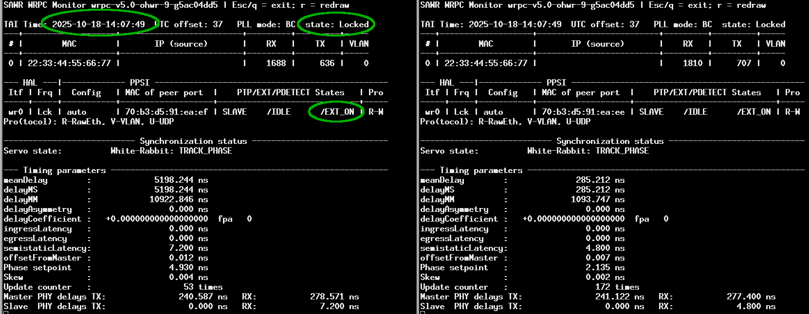
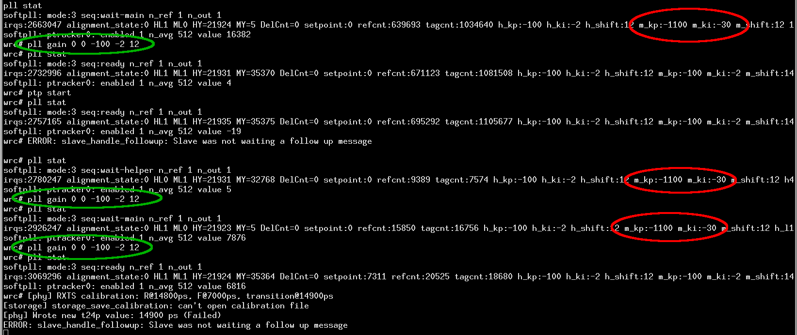
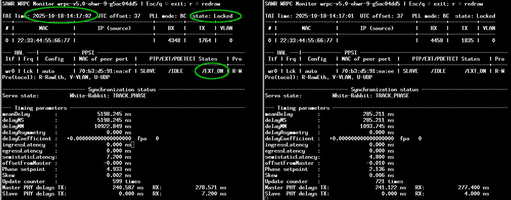
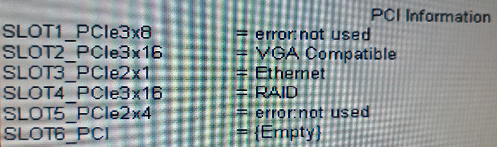
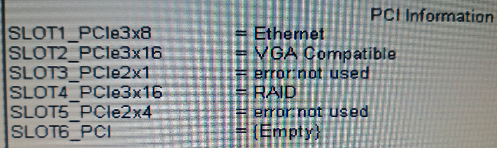
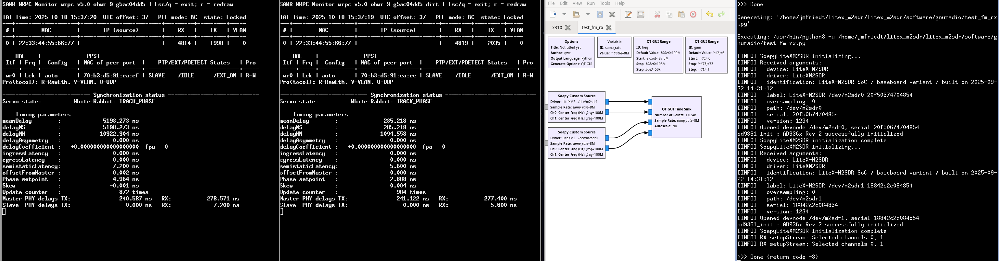

## Validation of ``wr_acorn``, ``litex_wr_nic`` and ``litex_m2sdr`` running White Rabbit

* ``wr_acorn`` and ``litex_wr_nic`` are both functional, but the
state machine must be understood in detail to properly reach phase lock.



This screenshot demonstrates the targeted result, namely ``TRACK_PHASE`` on 
two M2SDR boards connected to a White Rabbit master. We have concluded that
* if ``EXT_ON`` switches to ``EXT_OFF`` state, the lock can never be reached.
If the ``EXT_OFF`` state is reached before the phase is ``Locked`` (ie remains
``Locking``), then
```
ptp stop
ptp start
```
to restart the locking procedure. The proportional and integral coefficients,
Kp and Ki, are kept when restarting the lock.
* at startup, the Kp and Ki values are too large, especially with ``wr_acorn``
which uses the default ``wrpc_sw`` values of -1100 et -30. To change these values,
```
pll gain 0 0 -100 -2 12
pll gain -1 0 -100 -2 12
```
to switch the main (0 0) and helper (-1 0) PLL coefficients to -100 and -2. However,
the state machine sometimes returns these coefficients to their default value, so that
we constantly monitor the PLL state with
```
pll stat
```
and reprogram the Kp and Ki to our setpoints if changed. This sequence is shown in



Both PLLs are locked if ``HL=1`` and ``ML=1``, but only the last message ending with
``(Failed)`` indicates that phase lock was achieved. Once locked, the Phase Lock state remains
as shown in



saved 10 minutes later, and possibly some more agressive Kp and Ki could be used to improve tracking
capability.

Additionnally, the MAC address is the same for both M2SDR in this demonstration and yet does not
prevent WR lock. However, manually changing the MAC so that each board
has a different identifier might be desirable, at least for data transfer.
* firwmare programming through the PCIe bus: we have observed that when a terminal freezes, it is due
to an errouneous firmware transfer, as shown with the dump using ``test_cpu.py --dump-firmware``. We
have observed that 3 out of 4 bytes are null, leading to inconsistent opcodes that cannot be executed
by the softcore. Looking at the BIOS settings of the computer used in these tests, the initial
configuration with one board failing to be programmed is



where the two ``not used`` slots are fitted with M2SDR boards on PCIe adapters. Since
``dmidecode`` indicates ``Length: Short`` for the (bottom) functional board but
``Length: Long`` for the (top) non-functional board, we have switched the Ethernet board
on the PCI2x1 slot and the M2SDR on the PCI3x8 slot, leading to the following configuration:



in which both board firmware could be programmed by ``test_cpu.py`` through the PCIe bus,
leading to functional phase locks on the White Rabbit master as shown earlier.
* at the moment, streaming the data from two M2SDR boards to GNU Radio with two SoapySDR Custom
source blocks seems not functional. By using the ``path=/dev/m2sdrX`` driver option (instead 
of ``device=X``) with X=0 or 1, then we avoid the error of the source already being opened
but the flowchart fails with error -8



whereas each individual board is operating properly when streaming individually.
