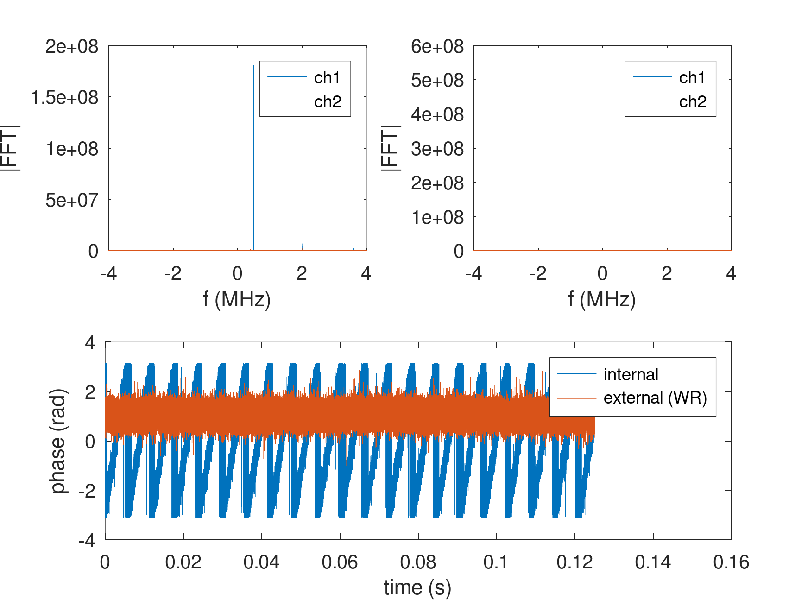

# White Rabbit on general purpose FPGA boards (without the dedicated external oscillators)

Starting from a setup where both White Rabbit are locked:


we configure the M2SDR for external clock synchronization (i.e. locking the Si5351 to the 10 MHz WR output)

```
sudo ./m2sdr_rf -c 0 -sync external -rx_freq 100000000 -rx_gain 20 -samplerate 8000000
sudo ./m2sdr_rf -c 1 -sync external -rx_freq 100000000 -rx_gain 20 -samplerate 8000000
```
with each command answering with messages such as
```
litex_m2sdr/litex_m2sdr/software/user$ sudo ./m2sdr_rf -c 0 -sync internal -rx_freq 100000000 -rx_gain 20 -samplerate 8000000
Initializing SI5351 Clocking...
Using internal XO as SI5351 RefClk...
Initializing AD9361 SPI...
Initializing AD9361 RFIC...
Setting Channel Mode to 2T2R.
ad9361_init : AD936x Rev 2 successfully initialized
Setting TX/RX Samplerate to 8.000000 MSPS.
Setting TX/RX Bandwidth to 56.000000 MHz.
Setting TX LO Freq to 2400.000000 MHz.
Setting RX LO Freq to 100.000000 MHz.
Setting TX Gain to -20 dB.
Setting RX Gain to 20 dB.
Setting Loopback to 0
Enabling 16-bit mode.
```

Then record a dataset from
```
sudo ./m2sdr_record -c 0 /tmp/0.bin 800000 & sudo ./m2sdr_record -c 1 /tmp/1.bin 800000
```
and in GNU Octave (see <a href="go.m">go.m"</a>):
```
f=fopen('/tmp/0.bin');
d=fread(f,inf,'int16');d=d(1:2:end)+j*d(2:2:end);d1=d(1:2:end);d2=d(2:2:end);
plot(real(d1))
f=fopen('/tmp/1.bin');
d=fread(f,inf,'int16');d=d(1:2:end)+j*d(2:2:end);d1=d(1:2:end);d2=d(2:2:end);
plot(real(d1))
```



after repeating with ``-sync external`` to demonstrate that the Si5351 is locked on the White Rabbit
disciplined 10 MHz output from the FPGA leading to syntonization.
