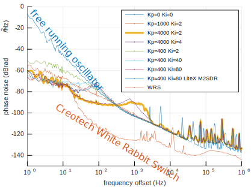
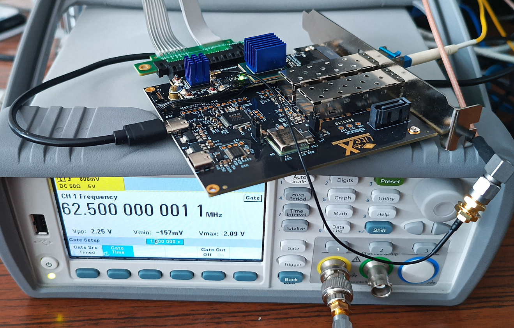
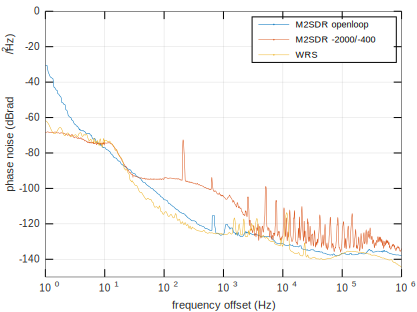
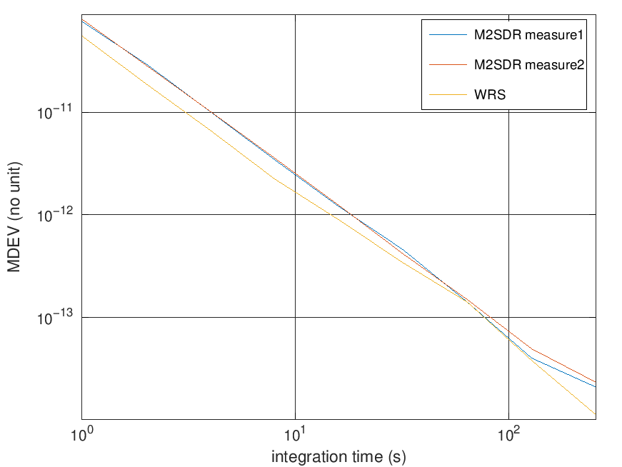
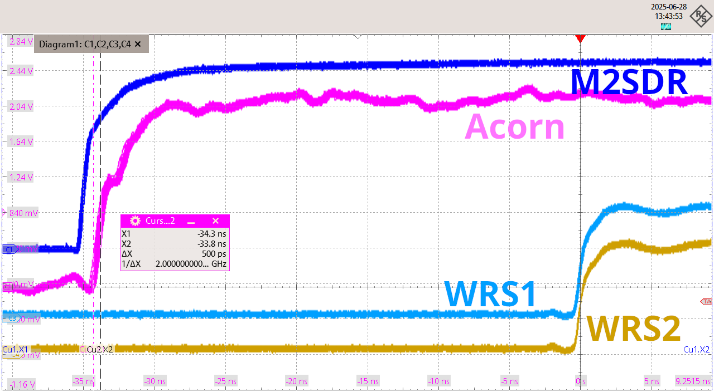

# White Rabbit on general purpose FPGA boards (without the dedicated external oscillators)

Based on the original contribution by <a href="https://www.missinglinkelectronics.com/wp-content/uploads/2024/03/MLE-Light-Rabbit-Presentation-at-13th-White-Rabbit-Workshop.pdf">Missing Link Electronics</a> at the 13th White Rabbit
Workshop at CERN in 2024 and with the help of Nikhef's <a href="https://www.nikhef.nl/~peterj/">Peter Jansweijer</a>
CLBv3 (found on <a href="https://gitlab.com/ohwr/project/wr-cores/-/tree/master/syn/clbv3_ref_design?ref_type=heads">the OHWR gitlab repository</a>), this project demonstrates a functional White Rabbit implementation
on the <a href="https://enjoy-digital-shop.myshopify.com/products/litex-acorn-baseboard-mini-sqrl-acorn-cle215">Acorn CLE215+</a> Artix7 FPGA.


## Synthesizing for the Acorn CLE215+

The patch applied to the White Rabbit PTP Core repository allowing to synthetsize the project for the Acorn
CLE215+ as well as the instructions are found in the <a href="patch/">patch</a> repository (tested with Xilinx Vivado 2022.2).

## PLL gain settings

From the shell connected to the embdded RISC-V processor, the main PLL gain coefficients (proportional and integral) are set using the command
```
pll gain 0 0 -400 -2 12
```

and similartly for the helper PLL (any negative number will do instead of -1 as 2nd argument)
```
pll gain -1 0 -400 -2 12
```

## Results

MDEV measurement as a function of PLL loop gain coefficients, changing Kp while
keeping Ki fixed (-2) except for two measurements, of the time interval between the 
White Rabbit Switche (WRS) and the CLE215+ 1-PPS outputs. For reference, WRS is the Modified 
Allan Deviation of the two PPS generated by two WRS (Creotech),
matching the expected value of about 60 ps jitter at 1 s integration time.


Beyond the long-term time-domain characteristics, the phase noise of a 10-MHz output
locked on the White Rabbit control signal is measurement as a function of control loop
parameters. Measurements performed using a Rohde & Schwarz FSWP 
Phase Noise Analyzer with 10-correlations in the 1-Hz bin.



All Modified Allan deviation of the 1-PPS outputs plot exhibit a $1/\tau$ slope, i.e. $1/\tau^2$ for the variance,
characteristic of flicker phase noise. The MVAR of flicker PM [1] level is $0.0855 h_1/\tau^2$: at
1 Hz, the phase noise of $-70$ dBc/Hz or $-67$ dBrad $^2$ /Hz would lead to 
$\sqrt{10^{-6.7}/(10^7)^2\cdot 0.0855}=1.4\cdot 10^{-11}$. The observed $5.5\cdot 10^{-11}$ hints at a noise
model too simple to account for all contributions.

From this analysis, we conclude that "optimal" loop coefficients are **Kp=-4000 and Ki=-2**.

The command ``pll stat`` must display something like
```
softpll: mode:3 seq:ready n_ref 1 n_out 1
irqs:400961 alignment_state:0 HL1 ML1 HY=25714 MY=42355 DelCnt=0 setpoint:17364 refcnt:209789 tagcnt:5
```
where HL1 means that the helper PLL is locked and ML1 means that the main PLL is 
locked.

[1] E. Rubiola, *Enrico's Chart of Phase Noise and Two-Sample Variances*, https://rubiola.org/pdf-static/Enrico%27s-chart-EFTS.pdf (2025)

## SFP brands

Some SFP seem to operate properly with the Acorn (but functional with the M2SDR), some not.

Tested as functional: Cisco GLC-BX-U BlueOptics BO15C3149620D

Tested as **non** functional: AXCEN AXGE-1254-0531

# Application to the M2SDR



```
git clone https://github.com/enjoy-digital/litex_wr_nic
cd litex_wr_nic
git checkout m2sdr
./m2sdr_wr_nic.py --build
openFPGALoader --fpga-part xc7a200tsbg484 --cable ft4232 --freq 20000000 --write-flash --bitstream litex_m2sdr_platform.bin
```
where we manually ``openFPGALoader`` rather than ``--flash`` to synthesize and flash on different computers.

Then for communicating between PC and M2SDR: either
```
bar=`lspci | grep Xil | cut -d\  -f1`
litex_server --pcie --pcie-bar $bar
```
and then 
```
litex_term crossover --csr-csv csr.csv
```
where ``csr.csv`` was found in the ``test/`` of ``litex_wr_nic`` after synthesis of the gateware, but the
resulting terminal can hardly display the ``gui`` output of the White Rabbit, so the preferred method is
to compile the ``litex_wr_nic/software/kernel`` modules and
```
sudo rmmod m2sdr        # in case it was loaded
sudo insmod liteuart.ko
sudo insmod litepcie.ko
minicom -D /dev/ttyLXU0
```
The WR clock output is measured using a frequency counter by adding in ``litex_wr_nic/m2sdr_wr_nic.py`` the signal ``self.comb += platform.request("sync_clk_in").eq(ClockSignal("wr"))``
as the last instruction of the ``__init()__`` function just before the ``main():``, after commenting ``platform.request("pps_out").eq(pps),`` to avoid a conflict on the SYNCDBG_CLK pin.

When loading a new gateware, the PCI board must be enumerated again using ``echo 1 > /sys/bus/pci/rescan``

**Note**: in case ``from litex_m2sdr import Platform`` fails when synthesizing the m2sdr branch of https://github.com/enjoy-digital/litex_wr_nic, make sure to
```
pip install --user -e .
```
in the litex_m2sdr repository.

**Note**: ``m2sdr_wr_nic.py --build`` synthesis fails with Vivado 2019.2 or 2020.1 and *succeeds* with Vivado 2022.2.

## Results

Phase noise (M2SDR scaled 62.5-MHz v.s White Rabbit switch 10-MHz output):



Allan deviation:





## M2SDR SDR with WR support

In ``litex_m2sdr``, assuming ``litex_wr_nic`` is at the same filesystem tree level (possibly update ``litex_m2sdr.py`` with the two 
``FIXME: Avoid harcoded path/platform`` directory information accordingly for different tree structure) and was installed using 
``pip install --user -e .``:
```
./litex_m2sdr.py --variant=baseboard --with-pcie --with-white-rabbit --build
```
on the build computer running Vivado (in our case 2022.2), and then on the target computer the PCIe with the M2SDR board is connected to:
```
openFPGALoader --fpga-part xc7a200tsbg484 --cable ft4232 --freq 20000000 --write-flash --bitstream ./build/litex_m2sdr_baseboard_pcie_x1_white_rabbit/gatewarelitex_m2sdr_baseboard_pcie_x1_white_rabbit.bin
sudo echo 1 > /sys/bus/pci/rescan
```
Then from a kernel module perspective, ``scp -r litex_m2sdr/software/`` from the build computer to the target computer and in ``software/kernel`` run ``make`` to
compile the kernel modules, leading to ``m2sdr.ko`` and ``liteuart.ko``. Once these two kernel modules are loaded
```
sudo insmod liteuart.ko
sudo insmod m2sdr.ko
```
the communication interface ``/dev/ttyLXU0`` is created and ``minicom -D /dev/ttyLXU0`` displays a prompt
```
wrc# ver                                                                                        
WR Core build: wrpc-v5.0-ohwr-9-g5ac04dd5-dirt (unsupported developer build)
Built: Jul 18 2025 08:28:12 by JM Friedt
Built for RISCV, 128 kB RAM, stack is 2048 bytes
```

**DO NOT** attempt to use the kernel modules found in ``litex_wr_nic``: despite similar names, they will kernel panic. Also make sure to
recompile the kernel according to the new gateware configuration since headers are automagically generated during gateware synthesis, so
that kernel modules must be recompiled accordingly on the target computer.

Result: phase-lock of the M2SDR with SDR capability on the WR switch master signal
```
SAWR WRPC Monitor wrpc-v5.0-ohwr-9-g5ac04dd5-dirt | Esc/q = exit; r = redraw

TAI Time: 2023-05-12-12:28:06  UTC offset: 37   PLL mode: BC  state: Locked 
---+-------------------+-------------------------+---------+---------+-----
 # |        MAC        |       IP (source)       |    RX   |    TX   | VLAN
---+-------------------+-------------------------+---------+---------+-----
 0 | 22:33:44:55:66:77 |                         |    3105 |    1291 |    0

--- HAL ---|------------- PPSI ------------------------------------------------
 Itf | Frq |  Config   | MAC of peer port  |    PTP/EXT/PDETECT States   | Pro 
-----+-----+-----------+-------------------+-----------------------------+-----
 wr0 | Lck | auto      | 70:b3:d5:91:ea:f0 | SLAVE    /IDLE      /EXT_ON | R-W 
Pro(tocol): R-RawEth, V-VLAN, U-UDP

--------------------------- Synchronization status ----------------------------
Servo state:          White-Rabbit: TRACK_PHASE                         

--- Timing parameters ---------------------------------------------------------
meanDelay        :              285.439 ns
delayMS          :              285.439 ns 
delayMM          :             1095.745 ns 
delayAsymmetry   :                0.000 ns
delayCoefficient :   +0.000000000000000000  fpa   0
ingressLatency   :                0.000 ns
egressLatency    :                0.000 ns
semistaticLatency:                6.400 ns
offsetFromMaster :               -0.025 ns
Phase setpoint   :                1.548 ns
Skew             :                0.067 ns
Update counter   :                  626 times
Master PHY delays TX:               238.809 ns   RX:           279.657 ns 
Slave  PHY delays TX:                 0.000 ns   RX:             6.400 ns 
```
