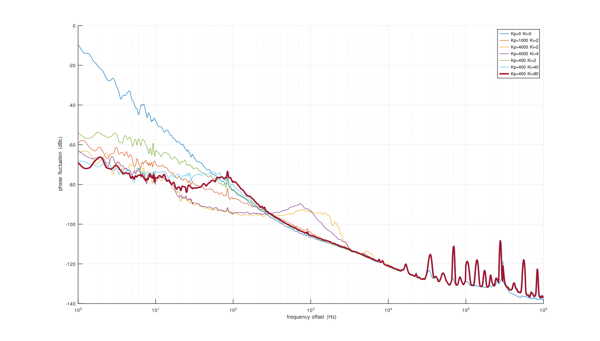

# White Rabbit on general purpose FPGA boards (without the dedicated external oscillators)

Based on the original contribution by <a href="https://www.missinglinkelectronics.com/wp-content/uploads/2024/03/MLE-Light-Rabbit-Presentation-at-13th-White-Rabbit-Workshop.pdf">Missing Link Electronics</a> at the 13th White Rabbit
Workshop at CERN in 2024 and with the help of Nikhef's <a href="https://www.nikhef.nl/~peterj/">Peter Jansweijer</a>
CLBv3 (found on <a href="https://gitlab.com/ohwr/project/wr-cores/-/tree/master/syn/clbv3_ref_design?ref_type=heads">the OHWR gitlab repository</a>), this project demonstrates a functional White Rabbit implementation
on the <a href="https://enjoy-digital-shop.myshopify.com/products/litex-acorn-baseboard-mini-sqrl-acorn-cle215">Acorn CLE215+</a> Artix7 FPGA.


Main PLL
```
pll gain 0 0 -400 -2 12
```

Helper PLL (any negative number will do instead of -1)
```
pll gain -1 0 -400 -2 12
```

MDEV measurement as a function of PLL loop gain coefficients, changing Kp while
keeping Ki fixed (-2) except for two measurements, of the time interval between the 
White Rabbit Switche (WRS) and the CLE215+ 1-PPS outputs. For reference, WRS is the Modified 
Allan Deviation of the two PPS generated by two WRS (Creotech),
matching the expected value of about 60 ps jitter at 1 s integration time.


Beyond the long-term time-domain characteristics, the phase noise of a 10-MHz output
locked on the White Rabbit control signal. Measurements performed using a Rohde & Schwarz FSWP 
Phase Noise Analyzer with 10-correlations in the 1-Hz bin.



From this analysis, we conclude that "optimal" loop coefficients are **Kp=-400 and Ki=-80**.

The command ``pll stat`` must display something like
```
softpll: mode:3 seq:ready n_ref 1 n_out 1
irqs:400961 alignment_state:0 HL1 ML1 HY=25714 MY=42355 DelCnt=0 setpoint:17364 refcnt:209789 tagcnt:5
```
where HL1 means that the help PLL is locked and ML1 means that the main PLL is 
locked.
