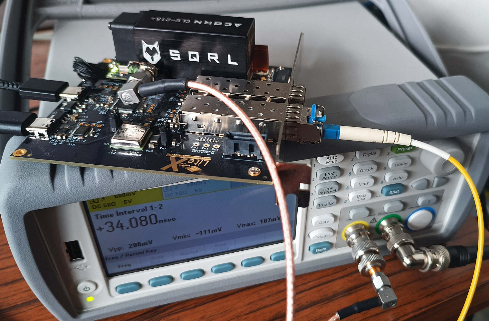
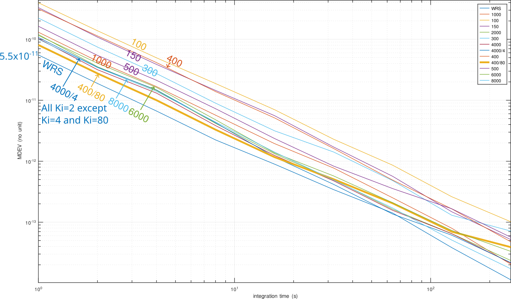

# White Rabbit on general purpose FPGA boards (without the dedicated external oscillators)

Based on the original contribution by <a href="https://www.missinglinkelectronics.com/wp-content/uploads/2024/03/MLE-Light-Rabbit-Presentation-at-13th-White-Rabbit-Workshop.pdf">Missing Link Electronics</a> at the 13th White Rabbit
Workshop at CERN in 2024 and with the help of Nikhef's <a href="https://www.nikhef.nl/~peterj/">Peter Jansweijer</a>
CLBv3 (found on <a href="https://gitlab.com/ohwr/project/wr-cores/-/tree/master/syn/clbv3_ref_design?ref_type=heads">the OHWR gitlab repository</a>), this project demonstrates a functional White Rabbit implementation
on the <a href="https://enjoy-digital-shop.myshopify.com/products/litex-acorn-baseboard-mini-sqrl-acorn-cle215">Acorn CLE215+</a> Artix7 FPGA.



Main PLL
```
pll gain 0 0 -400 -2 12
```

Helper PLL (any negative number will do instead of -1)
```
pll gain -1 0 -400 -2 12
```

MDEV measurement as a function of PLL loop gain coefficients, changing Kp while
keeping Ki fixed except for one measurement.


