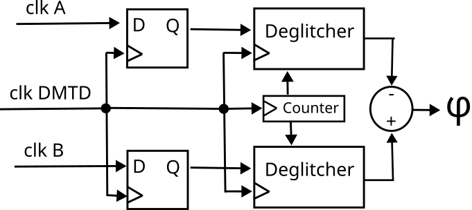
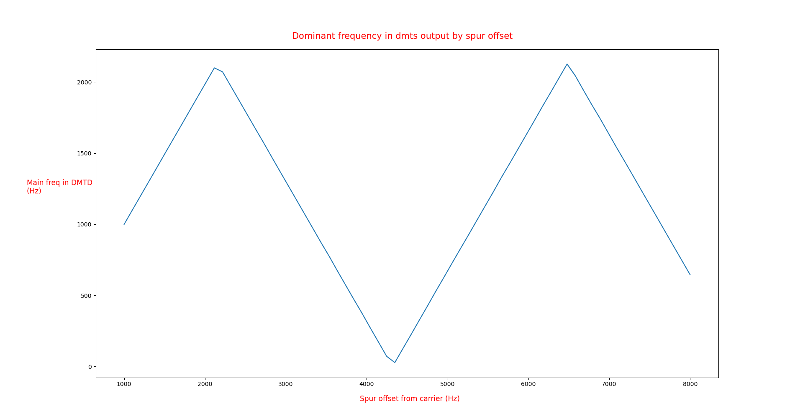
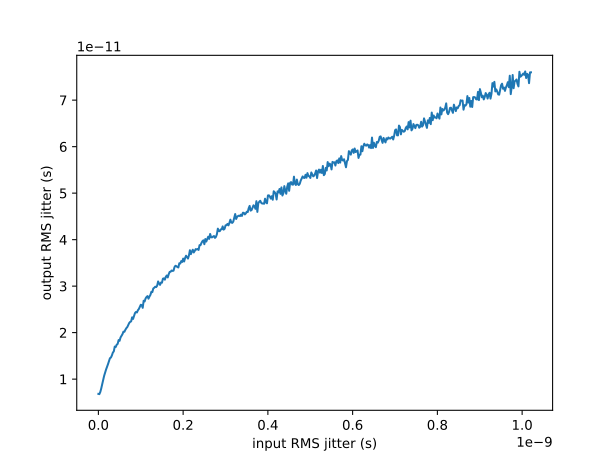
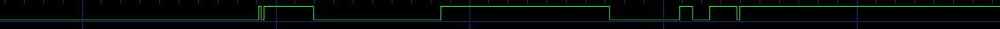

# DMTD isolated design for qualifying the phase detector

This repository provides a gateware for synthesizing an Amaranth implementation
of the <a href="https://white-rabbit.web.cern.ch/documents/White_Rabbit_Clock_Characteristics.pdf">DDMTD</a> for the Digilent Cmod-A7 board as described at
https://github.com/oscimp/amaranth_twstft/tree/main/pcb/cmodA7_twtft

This PCB includes one comparator converting the incoming clock signal to a square
wave (to pin 46), so that a second external comparator is needed to clock the second SMA 
located after the one connected to the SAW filter (pin 36). The DMTD phase comparator 
output is found on the SMA between the two clock inputs (pin 42). The output can
be fed to a phase noise analyzer or oscilloscope for statistical analysis of the
DMTD output.

## Digital Mixer Time Difference

The DMTD function is to measure fine timing of digital clocks. It does so by (sub)sampling the input clock with a frequency shifted clock to time-strech the input clock into a low-frequency signal which can be measured with a great resolution relative to its period, the output of the DMTD is a flow of time stamps (phase tags) of the stretched rising edges.

The *D*DMTD uses two DMTDs and takes the difference of the phase tags to output the relative phase of two clocks:

Here, to study this DDMTD phase meter we first focus on the simpler DMTD.

### Notations

The frequency ratio between the measured clock and the sampling clock (also called pivot or DMTD helper clock) is set as $2^N/(2^N - 1)$ with $N = 14$ unless specified otherwise.

This means that the frequency difference (named beatnote) is $1/2^N$ times the measured clock frequency. This beatnote also corresponds to the output rate the DMTD.

The output phase tags counts time in cycles of the pivot clock, in a noiseless systeme, they are each spaced of $2^N$ cycles.

The phase resolution is then of $N$ bits.

For example when measuring a 62.5 MHz clock with $N=14$, we get phase tags at the rate of $62.5e6/2^{14}=3.814$ kHz with a resolution of $16\cdot 10^{-9}/2^{14}\simeq 1$ ps.

## Aliasing

Since the DMTD is subsampling the input clock, it aliases high frequency noise in the small bandwith of it's low-frequency output (1.9 kHz bandwith in default White Rabbit).

This can be demonstrated by feeding a clock with a single spure of noise at a variable offset frequency and observing how this spur is folded into the dmtd's output:

frequency of the spur on the output in function of its frequency at the input

This hints that all the noise is conserved and folded ($2^N$ times) in the DMTD's bandwith leading to a $2^N$ times higher floor noise with the same noise power.

We observe that it is, in fact, not the case: by feeding the DMTD a clock with white gaussian phase noise and measuring the noise at the output we get this square root response:

DMTD stddev at the output in function of the stddev at the input

This nonlinear behavior cannot be explained by the (linear) sampling, this suggests there is a non-linear filtering action of the deglitcher.

## Glitches

Because of clocks jitter and/or metastabilities (we have yet to investigate which is dominant and wether they have distinct effects), the output of the sampling flip-flop contains many transitions for each ideal streched clock transitions.

ILA capture of the sampled clock.

The deglitcher process this waveform and computes the phase tag of the true transition. Multiple deglitchers algorithms have been proposed and evaluated ([Tom's thesis](https://gitlab.com/ohwr/project/white-rabbit/-/wikis/uploads/6a357829064b9e27a46fbce4cb4398b4/mgr.pdf)) empiricaly we find that the "bit median" produce the less noisy outputs but we lack a rigorous understanding of why.

The bit median deglitcher assumes that the glitches are like random independant "flip" errors on the true clean rising edge of the streched clock, following some constant (over time) distribution around this true rising edge.
It then compute and output the phase tag such that there is as many "up" glitches before the phase tag as "down" glitches after the phase tag.
This is exactly the same as a doing least square fit of the glitched signal with the ideal step and outputting the time of the fitted step's rising edge.
This kind of fit can be realized in many ways: this bit median / cross-correlation / convolution, these are all the same computation, of which the "bit median" algorithm is just a very efficient FPGA implementation. 

The length of this glichy window is directly proportional to the input clock jitter:

