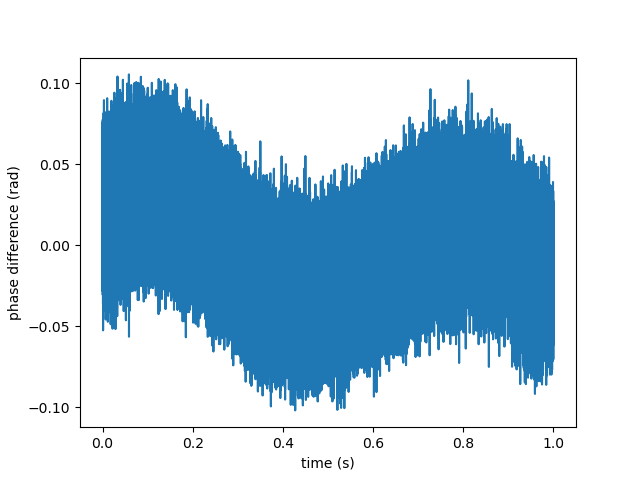
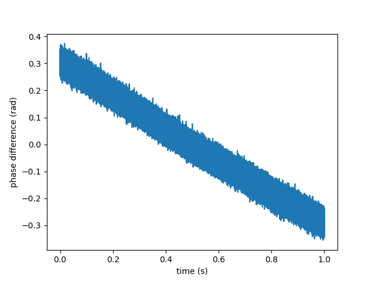
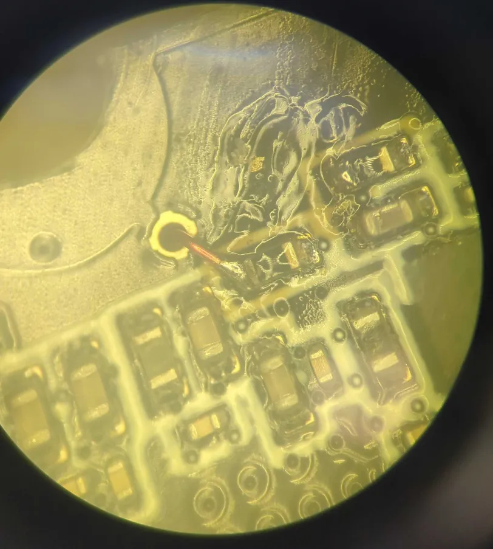
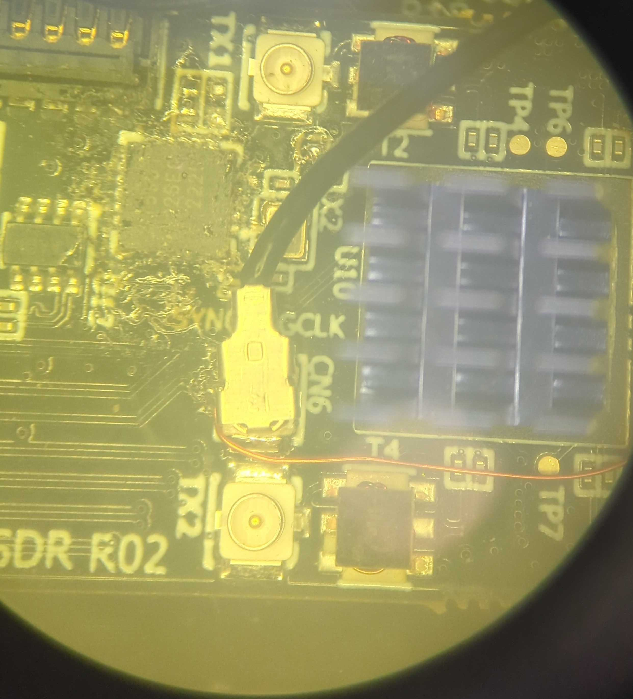

# Clocking the AD9361 from White Rabbit

This step allow to syntonize multiples M2SDR together using White Rabbit. Note that the SDR will not be syntonized to the White Rabbit clock because the AD9361's fractional PLL cannot synthesize some frequencies exactly, however multiple AD9361 clocked from the same source (White Rabbit clock) with the same configuration will be syntonized together.

## configuration

On the M2SDR, the AD9361 is clocked from an Si5351 which exists in three versions A, B and C. Only the version C support an external CMOS clock input.

The Si5351C `CLK_IN` pin is connected to pin `W22` of the FPGA named `si5351/ssen_clkin` in LiteX. Outputing a White Rabbit clock on this pin and configuring the Si5351 registers to use the `CLK_IN` as reference (registers <a href="https://www.skyworksinc.com/-/media/Skyworks/SL/documents/public/application-notes/AN619.pdf">CLKi_SRC in registers 16+i and Fanout Enable in register 187</a>) will result in the AD9361 syntonization.

This can be done with :

```
./m2sdr_rf -sync white-rabbit [other arguments for the desired rf config]
```

example :
```
./m2sdr_rf -sync white-rabbit -rx_freq 70000000 -rx_gain 20 -samplerate 10000000
```

## Syntonization verification

To check the syntonisation, the most straightforward way is to split a sinusoidal signal to two M2SDRs RX1 ports and record it with `m2sdr_record`.
Then the ratio of the IQ of one file by the other should be constant.

Example with a 70.5 MHz sine wave,

```bash
./m2sdr_rf -sync white-rabbit -rx_freq 70000000 -rx_gain 20 -samplerate 10000000 -c 0 # configure m2sdr0
./m2sdr_rf -sync white-rabbit -rx_freq 70000000 -rx_gain 20 -samplerate 10000000 -c 1 # configure m2sdr1

./m2sdr_record -c 0 /tmp/a.bin 10000000 & ./m2sdr_record -c 1 /tmp/b.bin 10000000 # record the sin wave with both m2sdr
```

Then analyze the phase rotation :
```py
import numpy as np
from matplotlib import pyplot as plt
a = np.fromfile('/tmp/a.bin', dtype='int16')
b = np.fromfile('/tmp/b.bin', dtype='int16')
a = a[::4] + 1j * a[1::4] # the IQ sine wave recorded by m2sdr0
b = b[::4] + 1j * b[1::4] # the IQ sine wave recorded by m2sdr1
plt.plot(np.angle(a / b)) # plot the phase difference, expecting a constant
plt.show()
```

When the SDRs are syntonized, their phase difference is a constant, as illustrated in the plot below:



When they are not, the phase drifts over time :




# DMA synchronisation on PPS

This step allows to synchronize the data stream on the PPS, effectively discarding all samples acquiered before the PPS rising edge.

WARNING: this needs White Rabbit to be locked (``phase tracking``). Indeed, White Rabbit will only output a PPS when locked to the master. If White Rabbit is not locked, no PPS will be emitted and the synchronization mechanism will wait for it indefinitely.

## DMA sync configuration

To use the DMA synchronisation, use the option `-dma-sync` on `m2sdr_rf` :

```
./m2sdr_rf -sync white-rabbit -rx_freq 70000000 -rx_gain 20 -samplerate 10000000 -c 1 -dma-sync
```

Then the next time `m2sdr_record` is called, the aquisition will start on the next PPS.

## DMA sync verification

To check the synchronization of the M2SDR, we record a pseudo-random sequence (PRN) starting on the PPS multiple times, and look at the cross correlation.
In our experiment, the PRN is generated with a CMOD-A7 board implementing <a href="https://github.com/oscimp/amaranth_twstft/">amaranth_twstft</a>.

The PRN is repeated 4 times per second, hence the 7 spikes on the cross correlation over one second:


A zoom on the central spike shows that all maximums are in a window of 100 ns, which matches the sampling period, showing that the DMA can synchronize streams up to a sampling period.

To achieve better synchronicity we will need to synchronize the ADC sampling clocks, which is detailed in the next section.


# ADC synchronisation

This step allows to synchronize the full datapath in the AD9361 to the White-Rabbit PPS and clock, including ADC clocking, digital filters and data stream clocks.

The RF clocks for the RX and TX mixers cannot be synchronized, they are syntonized on White Rabbit clock but the starting IQ phase is undeterministic (<a href="https://ez.analog.com/cfs-file/__key/telligent-evolution-components-attachments/00-441-00-00-00-07-91-97/AD9361_5F00_Reference_5F00_Manual_5F00_UG_2D00_570.pdf">UG-570</a> p. 87).

## Hardware modification for SYNC\_IN pin

To synchronize its datapath, the AD9361 needs a pulse on its `SYNC_IN` pin. The reference manual states that if two AD9361 are referenced to the same clock with the same configuration, and the `SYNC_IN` pulses are simultaneous, then both datapaths will opperate synchronously.

This pin is not connected to the FPGA on the M2SDR, but can be connected to the SYNDEBUG UFL port, which is controlled by the FPGA.
The `SYNC_IN` signal is accessible under the board near `TP5`, on the left pad of the circled resistor:


To make the connection sturdy enough we advise to pass an enamel wire through the hole at TP5:



On the other side, the wire can be soldered to the side of the UFL port, so as not to condemn it for other purposes.



## Si5351C passthrough

To achive synchronisation, the AD9361 of both M2SDR needs to be referenced to the same clock. We assume that the White Rabbit 62.5 MHz clock is the same on all locked M2SDRs.

With the basic syntonization, the White Rabbit 62.5 MHz clock is converted to 10 MHz by a PLL in the FPGA, which in turn is converted to 38.4 MHz by the Si5351C, which then clocks the AD9361.

These PLLs are not deterministic across multiple locks, and result in an unknown phase relationship between the refclks of two AD9361 syntonized on White Rabbit.

To avoid this undeterminism, we use the Si5351 in passthrough mode to clock the AD9361 with the 62.5 MHz from White Rabbit. This frequency is not optimal for the AD9361 to work with, but it is in the operating range.

The 62.5 MHz clock must also be inverted in the Si5351, in order to meet the timming constraints between the clock and the sync pulse (UG-570 p. 88).

## Synchronisation and verification

Once the hardware modification is done, using the ADC synchronisation requires synthesizing the gateware with `--with-white-rabbit --with-adc-sync` options, and use the `-adc-sync` option on `m2sdr_rf`.

Example compilation command:
```
./litex_m2sdr.py --variant=baseboard --with-white-rabbit --with-pcie --build --wr-sfp=0 --wr-dac-bits=24 --with-adc-sync
```

Example m2sdr configuration:
```
./m2sdr_rf -sync white-rabbit -rx_freq 70000000 -rx_gain 20 -samplerate 10000000 -c 1 -dma-sync -adc-sync
```

To test the synchronization, we use the same setup as with the DMA synchronization, and get better results :

