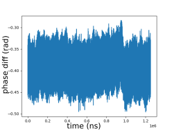
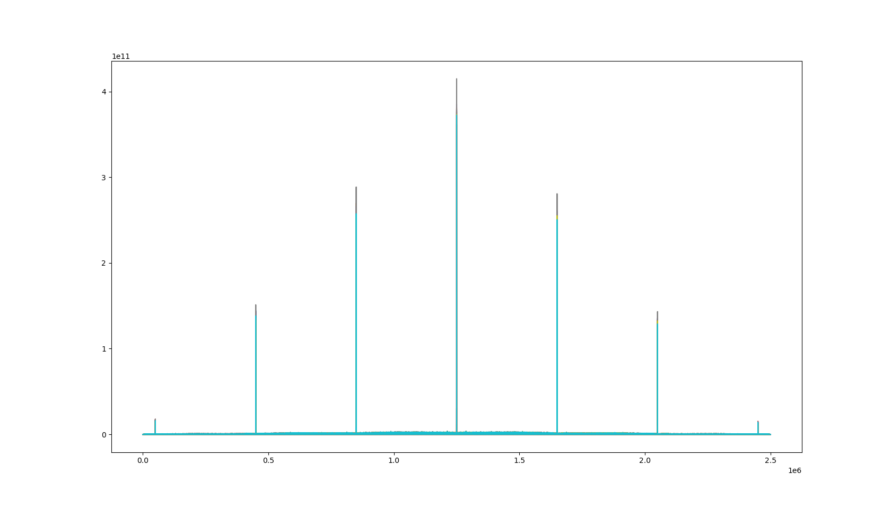
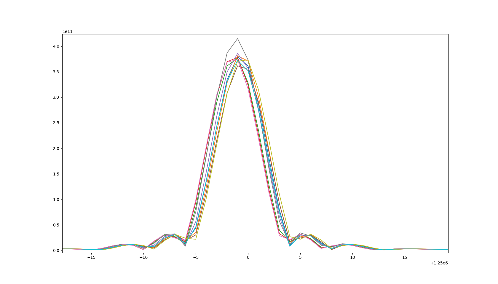
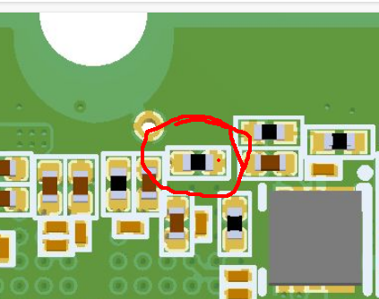

# clocking the ad9361 from white rabbit

This step allow to syntonize multiples m2sdr together using white rabbit. Note that the sdr will not be syntonized on white-rabbit because the ad9361's frac-pll can't synthesize some frequencies exactly, however multiple ad9361 clocked from the same source (white rabbit clock) with the same configuration will be syntonized together.

## configuration

On the m2sdr, the ad9361 is clocked from an si5351 which exist in three versions A, B and C, only the version C support a CMOS clock input.

The si5351c `CLK_IN` pin is connected to pin `W22` of the FPGA named `si5351/ssen_clkin` in litex. Outputing a white rabbit clock on this pin and configuring the si5351 registers to use the `CLK_IN` as reference will result in the ad9361 syntonization.

This can be done with :

```
./m2sdr_rf -sync white-rabbit [other arguments for the desired rf config]
```

example :
```
./m2sdr_rf -sync white-rabbit -rx_freq 70000000 -rx_gain 20 -samplerate 10000000
```

## syntonization verification

To check the syntonisation the most strait-forward way is to split a sinusoidal signal to two m2sdrs RX1 ports and record it with `m2sdr_record`.
Then the ratio of the IQ of one file by the other should be constant.

Example with a 70.5 MHz sin wave,

```bash
./m2sdr_rf -sync white-rabbit -rx_freq 70000000 -rx_gain 20 -samplerate 10000000 -c 0 # configure m2sdr0
./m2sdr_rf -sync white-rabbit -rx_freq 70000000 -rx_gain 20 -samplerate 10000000 -c 1 # configure m2sdr1

./m2sdr_record -c 0 /tmp/a.bin 10000000 & ./m2sdr_record -c 1 /tmp/b.bin 10000000 # record the sin wave with both m2sdr
```

Then analyse the phase rotation :
```py
import numpy as np
from matplotlib import pyplot as plt
a = np.fromfile('/tmp/a.bin', dtype='int16')
b = np.fromfile('/tmp/b.bin', dtype='int16')
a = a[::4] + 1j * a[1::4] # the IQ sin wave recorded by m2sdr0
b = b[::4] + 1j * b[1::4] # the IQ sin wave recorded by m2sdr1
plt.plot(np.angle(a / b)) # plot the phase difference, expecting a constant
plt.show()
```

When the sdr are syntonized, their phase difference is a constant, as examplified in the plot below :



When they are not, the phase drift over time :


# DMA synchronisation on PPS

This step allow to synchronize the data stream on the PPS, effectively discarding all samples acquiered before the PPS.

WARNING : this needs white rabbit to work, white rabbit will only output a PPS when locked to the master. If white rabbit isn't locked, no PPS will be emited and the synchronization mechanism will wait for it indefinitely.

## DMA sync configuration

To use the dma synchronisation simply use the option `-dma-sync` on `m2sdr_rf` :

```
./m2sdr_rf -sync white-rabbit -rx_freq 70000000 -rx_gain 20 -samplerate 10000000 -c 1 -dma-sync
```

Then the next time `m2sdr_record` is called, the aquisition will start on the next PPS.

## DMA sync verification

To check the synchronization of the m2sdr, we record a PRN (starting on the PPS) multiple times and look at the cross correlation.
In our experiment, the PRN is generated with cmod-a7 implementing `amaranth_twstft`.

The PRN is repeated 4 times per second, hence the 7 spikes on the cross correlation over one second:


A zoom on the central spike shows that all maximums are in a window of 100ns, which checks with the sampling period, this show that the DMA can synchronize streams up to a sampling period.
To achieve better synchronicity we will need to synchronize the sampling clocks, which is detailed in the next section.



# ADC synchronisation

This step allows to synchronize the full datapath in the ad9361 to the white-rabbit's PPS and clock, this include ADC clocking, digital filters and data stream clock.
The RF clocks for the RX and TX mixers can't be synchronized, they are syntonized on white-rabbit clock but the starting IQ phase is undeterministic.

## hardware mod for SYNC\_IN pin

To synchronize its datapath, the ad9361 needs a pulse on its `SYNC_IN` pin. The reference manual state that if two ad9361 are referenced on the same clock with the same configuration, and the `SYNC_IN` pulses are simultaneous, then both datapaths will opperate synchronously.

This pin is not connected to the FPGA on the m2sdr, but it can be connected to the SYNDEBUG UFL port, which is controled by the FPGA.
The `SYNC_IN` signal is accessible under the board near `TP5`, on the left pad of the circled resistor :



To make the connection sturdy enough we advise to pass an enamel wire through the hole at TP5 :


On the other side, the wire can be soldered to the side of the UFL port, so as not to condemn it for other purposes.
<img src='pictures/m2sdr_syncdebug.jpg'

## si5351-c passthrough

## checking and fixing timing constraint on SYNC\_IN pin

## synchronisation verification
