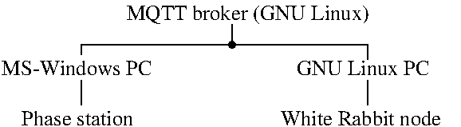

## Controlling the Microchip 53100A Phase Noise Analyzer (aka Phase Station) for qualifying the White Rabbit link

# Principle

The Microchip 53100A Phase Station is provided with a javascript interpreter to automate
data acquisition. Using the blocking MQTT Publish/Subscribe calls, the acquisition is
synchronized with a Python script assessing the state of the White Rabbit node and
controlling the start of data collection. The Phase Station stores the records on the
MS-Windows hard disk for post-processing.

# Setup

From the MQTT broker <a href="https://mosquitto.org/download/">repository</a> download
the MS-Windows version of Mosquitto clients and install on the MS-Windows computer
controlling the phase station since we are using a ping-pong scheme to sequence the
Phase Station acquisition and White Rabbit node behaviour control.
