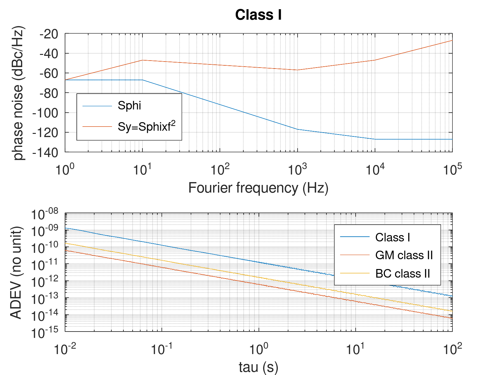

## Compute the time jitter from a phase noise spectrum in dBc/Hz.

Result: 36 ps when integrating to 10 MHz, 28 ps when integrating to 100 kHz

## Compute the Allan deviation from a phase noise spectrum in dBc/Hz.

See <a href="https://rubiola.org/pdf-lectures/Scientific%20Instruments%20L06-10,%20Oscillators.pdf">Enrico Rubiola's lecture</a>, slides 6 and 48-52 for the 
Phase Noise to Allan Deviation conversion explanation, and which $H(f)$ filter
function to use depending on the targeted deviation (Allan, Modified or Hadamard).

